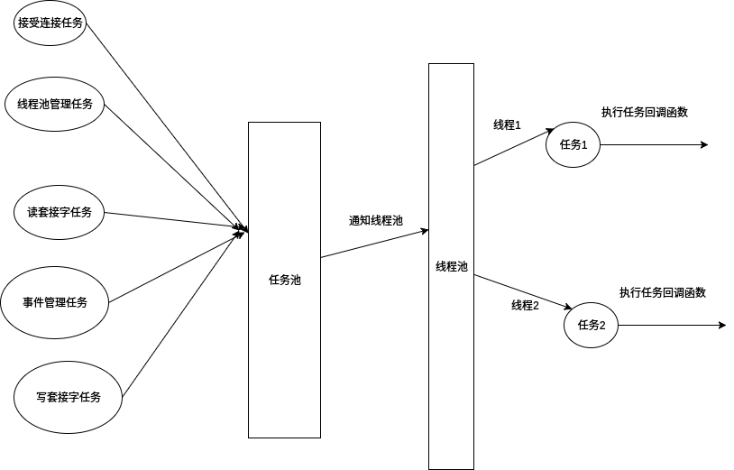

# HttpServer

此版本为<a href="https://github.com/lovercode/WebServer.git">WebServer</a>的改进版，之前的WebServer写的太挫了（虽然这个也很挫）

### 基本思路

### 目录说明
    BaseTask : 所有的任务（接受请求的任务，http处理任务）必须有这个结构体的成员 ，把所有会使用线程池的操作都抽象成了任务  
    AcceptConnectTask : 接受请求的任务（处理链接请求的任务）
    CPthreadPool : 线程池（所有线程）
    EventManageTask : 事件管理任务（管理超时事件）
    EventTree : 事件树（处理监听套接字，读写套接字，每个节点会有自己的任务）
    HttpTask : Http处理任务（http处理逻辑代码）
    linkTab : 通用链表
    Queue : 通用队列
    SocketConnect : 服务端socket创建
    server.c : main
