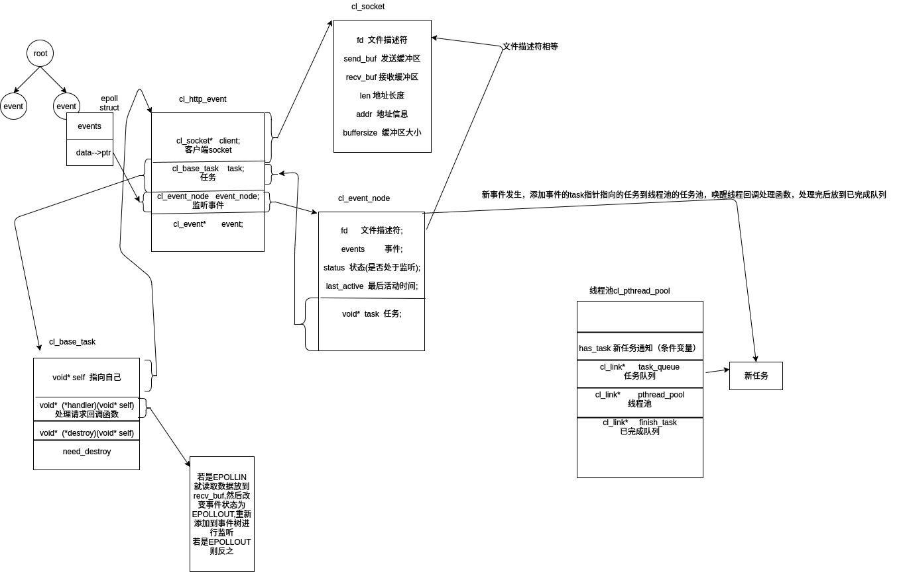

# HttpServer

此版本为<a href="https://github.com/lovercode/WebServer.git">WebServer</a>的改进版，之前的WebServer写的太挫了（虽然这个也很挫）

### 基本思路

### 目录说明
    cl_accept_task.h        接受请求的任务，直接添加到线程池的任务队列
    cl_base_task.h          用于线程池的任务队列调用的任务对象，类似基类的概念，其他任务（如接受请求的任务）想要能被线程池调用，就必须包含此对象
    cl_event.h              事件对象，epoll实现，如果一个事件想要被此对象监听，需要包含其中的cl_event_node结构体，当此对象中监听的事件发生，会把事件节点cl_event_node的任务指针指向的任务添加到线程池
    cl_http_event.h         http处理事件和处理任务的封装
    cl_link.h               通用链表
    cl_pthread_pool.h       线程池，所有线程阻塞在一个条件变量，等待任务到来，当任务到来后会调用任务的回调函数
    cl_socket.h             对socket的封装，每个socket会有两个共享内存映射，主要是作为发送数据和接受数据的缓冲区
    main.h                  主函数

### ab性能测试：

    codelover@codelover ~$ ab -n 10000 -c 1000 http://127.0.0.1:7777/index.html
    This is ApacheBench, Version 2.3 <$Revision: 1796539 $>
    Copyright 1996 Adam Twiss, Zeus Technology Ltd, http://www.zeustech.net/
    Licensed to The Apache Software Foundation, http://www.apache.org/

    Benchmarking 127.0.0.1 (be patient)
    Completed 1000 requests
    Completed 2000 requests
    Completed 3000 requests
    Completed 4000 requests
    Completed 5000 requests
    Completed 6000 requests
    Completed 7000 requests
    Completed 8000 requests
    Completed 9000 requests
    Completed 10000 requests
    Finished 10000 requests

    Server Software:        Codelover
    Server Hostname:        127.0.0.1
    Server Port:            7777

    Document Path:          /index.html
    Document Length:        30 bytes

    Concurrency Level:      1000
    Time taken for tests:   0.866 seconds
    Complete requests:      10000
    Failed requests:        0
    Total transferred:      1380000 bytes
    HTML transferred:       300000 bytes
    Requests per second:    11552.31 [#/sec] (mean)
    Time per request:       86.563 [ms] (mean)
    Time per request:       0.087 [ms] (mean, across all concurrent requests)
    Transfer rate:          1556.85 [Kbytes/sec] received

    Connection Times (ms)
              min  mean[+/-sd] median   max
    Connect:        0    1   2.4      0      21
    Processing:     0    2   7.3      0     208
    Waiting:        0    2   7.2      0     208
    Total:          0    3   8.6      1     225

    Percentage of the requests served within a certain time (ms)
    50%      1
    66%      1
    75%      1
    80%      1
    90%      4
    95%     12
    98%     23
    99%     50
    100%    225 (longest request)
